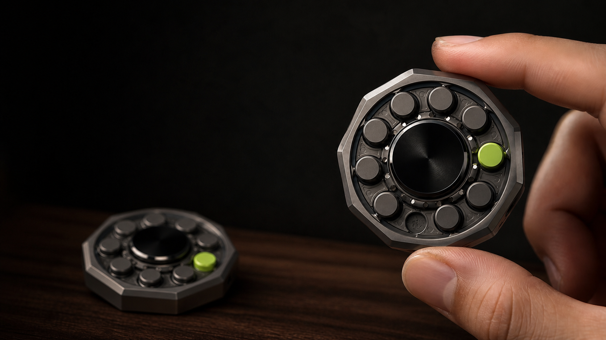

# Tenfold 十日环

Tenfold 是一枚把长期项目压缩成十日承诺的 AI EDC。AI 负责收集、去重和减法，机械盘负责把“回来、完成、停下”变成可触摸的动作。

> 当前黑客松状态：从零设计三版完整机械 EDC，并实现 Android APK 与 M5StickS3 通信。原玩具适配附件是前轮实验，不再是本轮交付目标；当前正在进行原创整机数字制造检查与软件安装验证，尚未实物打印。

## 黑客松实施入口（2026-09-22）

- [当前 PRD](docs/hackathon/product/HACKATHON_PRD.md)：硬件价值、替代方案、实现范围及验证方法。
- [产品裁决与市场依据](docs/hackathon/product/PRODUCT_DECISION.md)：日常主路径是“今天到这里，明天接得上”，以封存与恢复承接十日承诺。
- [当前实施约束](RULES.md)：原创完整 EDC、打印装配包、可安装 APK 与真实验证边界。
- [用户链路与交互协议](docs/hackathon/product/USER_JOURNEY.md)：输入、状态、确认、反馈、离线及恢复规则。
- [演示与评委问答](docs/hackathon/product/DEMO_AND_QA.md)、[需求验收矩阵](docs/hackathon/product/ACCEPTANCE_MATRIX.md)。
- [独立验收结论](docs/hackathon/acceptance/REVIEW.md)、[未决项](docs/hackathon/acceptance/BLOCKERS.md)。

**本轮黑客松实现以 `docs/hackathon/product/` 为交互权威。** 首次通过产品门的版本为 `e948b2c`。模型目录中的早期按键、双击、24 小时恢复等映射仅为未实现建议；冲突时不用于固件实现。几何检查通过不代表整机或 Demo 通过。

以下尺寸、无屏、十珠及金属机械盘描述保留为原产品愿景，不是本轮 Demo 的硬性要求。黑客松允许调整体量、屏幕和十珠表达，但必须保留真实机械把玩体验。

## 核心定义

- **载体**：46 × 46 × 14 mm 十边形掌心 EDC，口袋 / 桌面使用。
- **进度**：十枚可下沉日珠；每天完成后按下一枚，进度从 10 减到 0。
- **交互**：旋一下回来、按日珠完成、长按中央轴封存、双击进入 24 小时恢复。
- **AI**：把所有输入收敛为 1 个十日目标、最多 3 个结果、今天 1 个动作。
- **边界**：无屏、无常开麦、无健康传感、不诊断或治疗注意力问题。

## 仓库导航

| 内容 | 文件 |
|---|---|
| 完整 PRD | [docs/PRD.md](docs/PRD.md) |
| 外观与工业设计规范 | [docs/INDUSTRIAL_DESIGN.md](docs/INDUSTRIAL_DESIGN.md) |
| 硬件 / 固件 / App / AI 实现方案 | [docs/IMPLEMENTATION.md](docs/IMPLEMENTATION.md) |
| 外观设计图 | [design/Tenfold十日机械盘-v2.png](design/Tenfold十日机械盘-v2.png) |
| 可交互提案 | [prototype/Tenfold十日环-v2.html](prototype/Tenfold十日环-v2.html) |
| 市场、竞品与合规底稿 | [research/](research/) |

## 已锁定与待验证

### 已锁定

- 十边形金属机身、中央黑色旋压轴、十枚环形日珠。
- 石墨灰主体与酸性荧光绿状态色。
- 物理减法进度，无屏且不把任务列表搬到硬件上。
- 与 22:00 戒断 vibe coding App 协同。

### 待验证

- 十枚日珠的锁定、复位、公差、噪音、防尘与寿命。
- 中央轴旋转检测、触觉反馈、天线、电池和隐藏充电底座堆叠。
- 7–14 天续航目标、BLE 稳定性与量产良率。
- 用户留存、相对纯 App 的增量价值与真实支付意愿。

## 证据边界

市场与竞品数据以 2026-07-22 的来源快照为准。仓库不虚构“高端科技 EDC”TAM，也不把相邻产品的销量直接外推为 Tenfold 需求。BOM 是工程估算，不是供应商报价。
