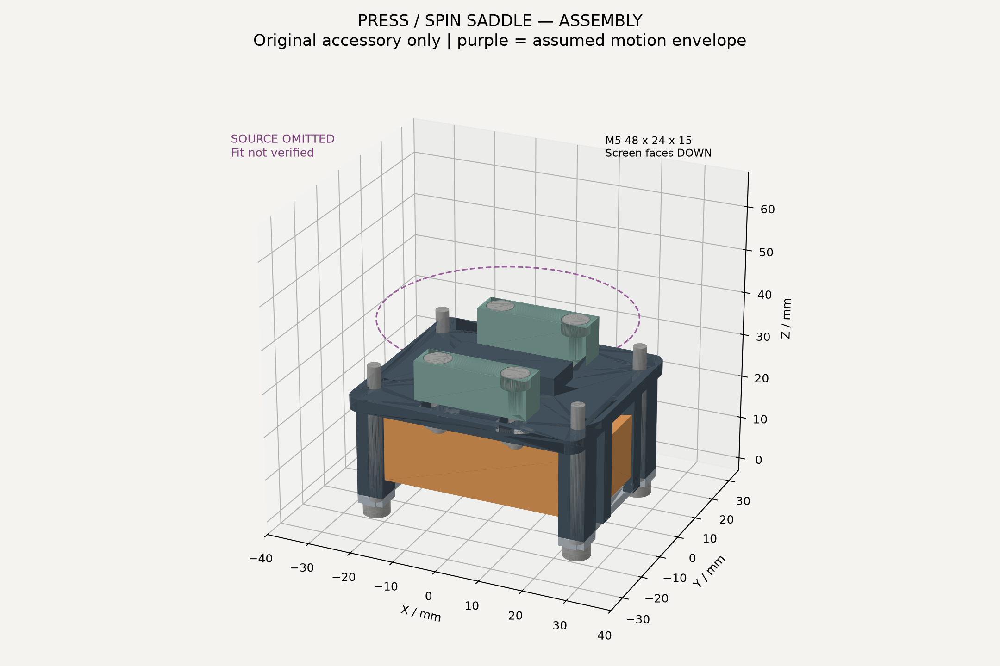

# 十日环 · 一岁山按压旋转式双面电子托架

**整套仍是条件概念，原模型接口尺寸未验证。** 仅原创附件CAD可以进行几何验收；这不是原模型复刻，也不是已经适配成功的整机。原3MF正常下载要求登录，未取得文件。**是否有能夹住的独立静止底座仍未知**；若底面随瓶身转动或没有足够静止接触面，本托架不能直接安装。未做实物打印。

## 原模型证据与许可

[MakerWorld中国站2710405](https://makerworld.com.cn/models/2710405?appSharePlatform=copy)：《一岁山 按压 旋转 版（百岁山）》，作者瑟雷斯汀。2026-09-22实际打开页面、展开许可与下载菜单。

- 作者正文要求机械按键。作者评论说明螺丝/螺母穿过轴承后放入外壳，打印贴板面朝下。用户评论指出按压不会自动旋转，需手动转瓶身。本方案保留两种独立机械动作，不宣称按压驱动旋转。
- 页面两个配置：作者0.12mm层高、3墙、10%填充，显示4.4h；另一个多色单盘配置显示2.1h。均不是附件打印时间。
- 下载菜单有3MF与STL/CAD，明确作者未上传STL/CAD，STL根据配置自动生成。点击3MF后提示「请登录后下载模型」。现有Chrome会话检查遭连接策略错误，未读取cookie或绕过登录。
- 展开的Standard Digital File License禁止分享、托管、分发原件及其衍生数字/物理作品。仓库为PUBLIC，所以没有上传原件、原件重建、纹样或原页面图片。本目录基本几何附件独立设计；紫色圆不是原瓶模型。

## 紧凑形态、尺寸与代价

采用双面叠层：原机构在上，M5整机在下，屏幕朝下。把玩时握住下托架，拇指按瓶盖/拨动瓶身；查看状态时翻面。

| 范围 | 尺寸 |
|---|---|
| 原创附件装配，含压条与夹爪 | **54×48×36mm（仅打印件）** |
| 含底部螺钉头的附件 | **54×48×39mm** |
| M5包络 | 48×24×15mm，X=-24..24、Y=-12..12、Z=2.6..17.6 |
| 假设扫掠包络 | 半径28mm，Z=41..76，**不是原模型尺寸** |
| 附件+该假设包络 | 56×56×79mm，**不能当作整机实测尺寸** |
| 实际整机 | 尚未知；必须取得原件高度、扫掠与安装面后重算 |

相比并排架缩小了平面，但增加厚度且要翻面看屏幕。若原件较高，整机可能更适合桌面随手拿起而非裤袋EDC；不把54×48的盖板尺寸冒充整机尺寸。

握持示意：掌心托住M5侧的四角支柱，食指/中指夹住两侧外缘；拇指从上方按原瓶盖或拨原瓶身。手指不进入上下旋转剪切缝。见[双面与握持示意](grip.png)。此示意仅说明姿态，未验证手掌舒适度。

## 机构、载荷与接口

两爪各用两枚M3螺钉在长槽内调整，配1mm软垫。默认静止底座宽22mm，可调10–30mm。只夹静止部件，不能夹瓶身、瓶盖、轴承运动圈。先手动轻压贴合再锁紧竖向螺栓，不用螺栓强挤转轴。

座台顶Z31，加1mm软垫后原底面Z32；爪顶Z36，需要至少4mm高静止侧面接触区。假设运动最低Z41，爪顶净距5mm；真实按压到底与转动360°都必须重测。夹爪适配并未成立。

按压力路径：原静止座→座台→3mm上盖→四角支柱→手掌/桌面。**设计上不通过屏幕承受按压力**，但尚未进行载荷/挠度和实物验证。M5背面与主上盖有6.4mm空间，预留螺母及机械隔离；四个后背角限位片最低Z18.2，距设备背面0.6mm，仅限制抬升，不施加预压；不放硬垫顶住设备背面。M5下方两条可拆压条仅配0.6mm软垫轻托前面两端边框，不预压屏幕。实际端部是否为安全边框必须用实机核对，若压条碰玻璃有效区就停装并改压条。

夹爪M3×14从头底Z33向下至Z19，距M5顶17.6尚1.4mm；不得换更长螺钉。螺母/垫圈需在上盖下空间内，先装夹爪再装M5。四角压条螺钉位于设备包络外，不跨屏幕。

## M5官方信息与避让

[M5官方StickS3文档](https://docs.m5stack.com/en/core/StickS3)核实K150整机尺寸、USB-C、KEY1/KEY2、侧面Reset、HY2.0-4P及Hat2。不拆机。官方Reset双击为关机，不应映射为恢复动作。

- 屏幕朝-Z，翻面查看。两端压条在X=±23.7，中央开口沿X宽44.4mm，沿Y至少24mm无遮盖；是否遮到正面键仍需实机验证。
- X向端部挡边内表面X=±24.6，名义间隙0.6mm。端面中央Y=-6..6为12mm宽通道，USB插头须由此进入；插头外壳超过12mm需扩孔后再验收。
- 长边中部完全开放；四角支柱Y内面±13.5，距整机1.5mm，可贴1mm软垫减晃。不能用软垫盖住侧键。
- 侧键、Reset、Grove和Hat2的精确坐标未完成官方机械图核对，不宣称全部实测可达。无需使用的后背接口可能被上盖遮挡；扩展排线不得压在设备和上盖之间。
- 四个后背角限位片限制设备抬升；实际若碰到原机接口或凸起必须修改，不可强塞。可另用柔性防脱带松弛固定到侧柱，不可垫硬物将按压力传到M5。日常倒置、防跌落与运输保持力尚未验证。

## 文件与复现

| 文件 | 用途 |
|---|---|
| build.py | 可编辑CadQuery参数、STEP/STL导出、校验、CAD网格渲染 |
| spine.stl / spine.step | 上盖、四角承力支柱、原件座台 |
| jaw_front / jaw_back 的STL和STEP | 两只可调夹爪 |
| retainer_left / retainer_right 的STL和STEP | 两条可拆底压条 |
| accessory_assembly.step | 原创五件装配，不含M5/原件 |
| assembly.png / exploded.png / grip.png | 真实CAD附件预览、爆炸与握持说明 |
| validation.json | 网格闭合、CAD有效性、尺寸、零件/M5干涉、假设扫掠空间和夹持范围检查 |

Python3.12运行：`python -m pip install -r requirements.txt`，再`python build.py`。改P字典的夹持宽度或假设扫掠参数后须重跑；模型单位mm。STEP保留装配坐标，STL平移至Z0；上盖STL已翻转便于支柱向上打印，但座台突出需局部支撑。

## BOM、打印与装配

| 项目 | 数量 | 说明 |
|---|---:|---|
| 原一岁山机构 | 1 | 从作者处合法取得，原按键/轴承/紧固件按原文件确认，不随附件分发 |
| M5StickS3 K150 | 1 | 整机 |
| 上盖、夹爪、底压条 | 1+2+2 | PETG建议0.2mm层高、4墙、30–40%填充 |
| M3×14内六角螺钉 | 4 | 夹爪，头径≤6、高≤3，不可加长 |
| M3×32螺钉 | 4 | 从底压条穿角柱到顶盖；实际螺母/垫圈需确认，突出顶盖不影响夹爪 |
| M3薄螺母/锁紧螺母、垫圈 | 各8 | 夹爪下方螺母高≤3mm、垫圈≤0.5mm，避免进入M5包络 |
| 1mm软垫 | 按需 | 原静止座、两爪、M5侧向缓冲 |
| 0.6mm软垫 | 2条 | M5前端边框支承，不得盖屏幕有效区 |
| 柔性可拆防脱带 | 1 | 松弛绑定侧柱，禁止硬顶背面 |

上盖翻转打印，需要座台周边的局部支撑；拆支撑后检查M3槽、上盖平面与细柱。爪与压条平放打印，无支撑。先打印一个夹爪验证孔径和6.4mm沉孔，再打印全部。以上为原型工艺建议，无打印时长/耐久承诺。

装配：先单独验证原玩具手感→测静止夹持面→附件去毛刺→先装夹爪螺钉及上盖下螺母→确认螺纹最低Z≥19→从下方放入M5，屏朝下→装两压条及软垫，螺钉只锁柱体，不挤M5→原静止座放上座台、调爪轻夹→全行程按压及360°转动→检查屏幕/侧键/USB插拔→100次按压、100圈旋转和翻面保持测试。上述实物步骤均未执行。

## 尚未完成的验收

必须测：静止/运动部件辨认；静止底座宽度、接触高度与长度；旋转轴；最大半径、最低扫掠Z；按压行程；原螺母凸出；整机高度；夹持是否增加轴承阻力；手指夹缝；压条与屏幕边框关系；USB插头/按键可达；支柱强度与握持重心。若无静止夹持面，应重新设计底轴连接，不能夹住转子交差。

## 十日交互映射（未写固件）

| 动作 | 语义 | 边界 |
|---|---|---|
| 手动转原瓶身 | 回来、进入今日动作 | 真实机械把玩；无传感器，不产生数字事件 |
| 按原瓶盖 | 减压、开始仪式 | 保留原机械按键回弹；未接线 |
| M5可编程键短按 | 今天完成，十格减一 | 需后续固件，一天一次 |
| M5可编程键长按 | Seal | 需后续固件，与Reset分开 |
| 另一可编程键双击 | 24h恢复 | 需后续固件，不用系统Reset |

十珠降级为屏幕十格，机械体验仍由原按压与轴承旋转提供。后续要检测原按键，须核对型号/接线并避免导线跨旋转副。本任务不承诺蓝牙、振动、语音或续航。
