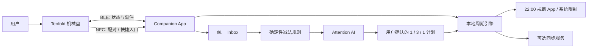
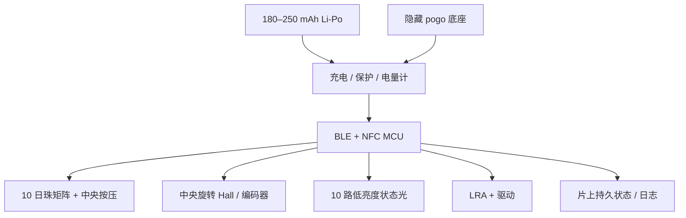

# Tenfold 十日环｜实现方案

版本：v0.1
日期：2026-08-03
用途：结构、电子、固件、App、AI 和制造团队的第一轮技术评审

## 1. 实现原则

1. **先机械、后电子**：十珠减法必须在断电时仍可读。
2. **离线可用**：没有手机、网络或模型时，用户仍可完成、封存和恢复。
3. **AI 可替换**：产品逻辑不绑定单一模型或供应商。
4. **载荷隔离**：按压、跌落和把玩载荷走金属骨架，不压 PCB 或电池。
5. **状态唯一**：设备保存事件，App 负责合并；所有同步必须幂等。
6. **外观锁定、内部开放**：十边形、十珠和中央旋压不变，内部方案由验证结果竞争。

## 2. 系统架构



核心状态由本地周期引擎管理。云端只用于跨设备同步、连接器和经用户授权的 AI 推理，不应成为按下一枚日珠的单点故障。

## 3. 机械方案

### 3.1 推荐 EVT 结构

#### 十枚日珠

- 十枚独立轴向柱，行程 1.2–1.5 mm。
- 每枚使用机械卡扣 / 弹簧 detent 保持“弹起 / 下沉”两个稳定位置。
- 日珠底部通过轻触开关或磁性位置检测向 MCU 报告状态。
- 当前日珠由下方低亮度绿光指示；其他日珠不常亮。
- 完成后，机械位置本身保留，即使断电仍看得见。

#### 统一复位

- 十枚柱下方布置环形复位凸轮。
- 用户按住中央轴并逆时针旋转，凸轮逐步抬起全部已下沉日珠。
- 复位动作需要明显阻尼和二次意图，避免口袋误触。
- EVT 同时保留“逐枚 push-push 复位”备选，以比较结构厚度、寿命和成本。

#### 中央旋压轴

- R188 级轴承尺寸可作为手感原型起点，但不直接复制竞品结构。
- 旋转手感由机械磁性棘轮形成 10 个轻 detent；连续旋转仍需顺滑。
- 电子检测优先评估单个低功耗 Hall 传感器 + 多极磁环；备选为薄型旋转编码器。
- 轴向按压由独立金属弹片 / 轻触开关检测，机械止挡承担载荷。

### 3.2 机械原型竞争项

| 方案 | 优点 | 风险 | 决策测试 |
|---|---|---|---|
| 独立锁定柱 + 统一复位凸轮 | 状态直观、断电保留、可单独维修 | 零件多、公差链长 | 10k 循环、误触、厚度、装配时长 |
| 十珠 push-push 独立机构 | 零件成熟、原型快 | 新周期需逐枚复位或增加机构 | 用户是否接受复位仪式 |
| 单环步进凸轮 | 零件少、顺序天然正确 | 结构设计难、单点卡死影响全环 | 污染、偏载、跌落后可靠性 |

P1 机械样机应至少做前两种，不应直接开正式模具。

## 4. 电子架构



### 4.1 MCU 路线

- **EVT 推荐**：nRF52840 模组或同级已验证 BLE/NFC 模组，优先降低 RF、DFU 和开发风险。
- **DVT cost-down**：根据 GPIO、Flash、RAM、功耗和供应情况评估 nRF52832 / nRF52833 或等效器件。
- 不在 PRD 阶段锁死具体芯片；必须比较模块认证覆盖、天线禁布区、交期与第二来源。

### 4.2 输入与状态光

- 十珠输入可用 `3 × 4` 低功耗按键矩阵，保留二极管避免鬼键；若采用 Hall 位置检测，则按中断唤醒并周期性低频校验。
- 十路状态光不需要 RGB 全彩；可用单色绿光 + 导光结构降低功耗和视觉噪音。
- 量产应避免十颗独立智能 LED 的高静态功耗和供应风险。

### 4.3 触觉

- 使用 8–10 mm LRA 和闭环 / 波形驱动器，区分“回来、完成、封存、恢复、错误”。
- EVT 可采用 DRV2605L 级方案快速调手感；DVT 再评估 MCU PWM / 更低成本驱动。

### 4.4 电源

- 目标电池：180–250 mAh 带保护软包电芯，最终容量由堆叠确定。
- 充电：隐藏 pogo-pin 底座，5 V 输入；防反接、过流、过温与异物短路。
- 低电量时保留机械功能；电子进入降级状态并减少灯光 / 触觉。
- 目标：EVT ≥7 天，DVT ≥10 天；不以实验室待机时间替代真实使用续航。

### 4.5 初步功耗预算

| 模块 | 工作模式 | 目标平均贡献 |
|---|---|---:|
| MCU + BLE | 广播、短同步、深睡 | 5–12 µA |
| 输入检测 | 中断为主、低频校验 | 3–10 µA |
| 状态光 | 每日短时点亮 | <10 µA 日均 |
| LRA | 每日数十次短震 | <15 µA 日均 |
| 电源与漏电 | PMIC、电量计、保护 | 5–15 µA |
| **目标平均电流** | 真实使用 | **<50 µA** |

以上是设计预算，不是元件实测。EVT 必须用电流分析仪记录广播、同步、震动、灯光、充电和深睡波形。

## 5. 固件

### 5.1 模块

```text
boot / signed DFU
device state machine
input scanner and debounce
mechanical position reconciliation
haptic and light patterns
BLE GATT service
NFC pairing payload
event journal and settings
power manager
factory test mode
```

### 5.2 事件模型

每个事件包含：

```json
{
  "device_id": "opaque-id",
  "cycle_id": "uuid",
  "seq": 42,
  "type": "DAY_COMPLETED",
  "day_index": 4,
  "device_time": 1785772800,
  "state_before": "ACTIVE",
  "state_after": "DAY_DONE",
  "battery_mv": 3860
}
```

- `seq` 在设备内单调递增。
- App 以 `(device_id, seq)` 幂等去重。
- 设备不保存任务文本，只保存周期和硬件事件。
- 时钟未同步时保留相对顺序，App 重连后补标准时间。

### 5.3 BLE 服务建议

| Characteristic | 方向 | 用途 |
|---|---|---|
| Device Status | notify / read | 电量、固件、绑定、错误 |
| Cycle State | read / write | 周期 ID、当前天、Seal / Grace |
| Event Journal | notify / read | 增量事件同步 |
| Device Command | write | 触觉测试、状态校正、复位确认 |
| DFU | secure | 签名升级与回滚 |

具体 UUID 在固件 spec 中冻结。绑定后写操作需要应用层认证，不能只依赖“在 BLE 范围内”。

### 5.4 机械与数字状态校正

启动和重连时读取十珠物理位置，与持久状态比较：

1. 一致：正常进入周期。
2. 单枚差异且符合顺序：生成本地恢复事件，要求 App 确认。
3. 多枚异常或顺序错误：进入 `MECHANICAL_MISMATCH`，不自动重写历史。
4. 用户通过 App 引导逐枚检查或执行物理复位。

## 6. App 与戒断功能

### 6.1 首版模块

- 设备配对与固件升级。
- Inbox 和连接器授权。
- 十日计划确认与停车场。
- 今日单动作卡。
- Seal 时间、Override 和 24h Grace。
- 设备状态、日志导出、解绑和删除。

### 6.2 与现有戒断 vibe coding App 的集成

优先级：

1. **同一 App 模块化**：共享用户、周期引擎与 Seal 状态，最少同步问题。
2. **本地系统接口**：App Intent / Shortcut / deep link；在设备端触发 Seal 后调用现有限制能力。
3. **云端事件**：只有本地路径无法覆盖多设备时才使用；必须处理离线与延迟。

最低接口：

```text
startCycle(cycleId, sealTime)
sealNow(reason)
requestOverride(sacrificeText)
enterGrace(until)
getRestrictionState()
```

Tenfold 不负责实现操作系统无法保证的“绝对阻止”。产品文案必须区分提醒、软限制和系统级限制。

## 7. Attention AI

### 7.1 管线


### 7.2 输出 Schema

```json
{
  "goal": "十天后可验证的一句话完成定义",
  "outcomes": ["最多三个可验证结果"],
  "today_action": {
    "verb": "动作动词",
    "object": "唯一对象",
    "timebox_minutes": 12,
    "done_when": "可观察完成条件"
  },
  "parked_items": [
    {"id": "source-id", "reason": "为什么现在不做"}
  ],
  "uncertainties": ["需要用户确认的事实"]
}
```

校验器拒绝以下输出：多个主目标、超过三个结果、没有动词的动作、超过当天预算、医学推断、未经允许删除任务。

### 7.3 模型策略

- 先用确定性规则缩小输入，再调用模型，降低成本和幻觉面。
- 支持供应商适配层；Prompt、Schema 和评测集与模型解耦。
- 记录模型版本、提示版本和用户接受 / 修改结果，不记录隐藏推理。
- 高敏任务可选择只在本地运行规则，不调用模型。

## 8. 数据与安全

### 8.1 数据分层

| 数据 | 默认位置 | 云端条件 |
|---|---|---|
| 十珠状态、设备事件 | 设备 + App 本地 | 用户开启同步 |
| 目标与任务文本 | App 本地数据库 | 用户逐连接器 / 模型授权 |
| 诊断日志 | 设备 / App 短期 | 用户主动发送或明确同意 |
| 原始音频 / 生理数据 | 不采集 | 不适用 |

### 8.2 安全要求

- 设备绑定使用一次性 challenge，避免静态配对码。
- BLE 写操作需要绑定密钥；敏感设置不允许未认证广播修改。
- 固件签名校验、版本回滚保护和安全恢复。
- 本地数据库使用系统密钥存储；云端传输 TLS。
- 连接器 token 使用平台安全存储，不写入设备或日志。
- 提供删除、导出、解绑和售前 / 二手转移流程。

## 9. 工程 BOM

| 子系统 | EVT 方案 | 1000 台估算 |
|---|---|---:|
| MCU / RF | nRF52840 模组级起步 | 含在电子项 |
| 输入 | 十珠矩阵 + 中央按键 + Hall / 编码器 | 含在电子 / 机械项 |
| 光 / 触觉 | 10 路绿光、LRA、驱动 | 含在电子 / 触觉项 |
| 电源 | 180–250 mAh 电芯、充电与保护 | 含在电池项 |
| 电子 / PCBA | PCB、SMT、连接与测试点 | ¥55–95 |
| 铝机身 / 表面 | CNC、内环、喷砂阳极 | ¥70–135 |
| 十珠 / 中央机械 | 陶瓷帽、锁定柱、凸轮、棘轮 | ¥60–120 |
| 电池 / 触觉 | 电芯、LRA、驱动、触点 | ¥25–45 |
| 装配 / 测试 | 公差配组、烧录、功能测试、良率预留 | ¥30–65 |
| 包装 / 底座 | 包装、隐藏充电底座、备件 | ¥20–45 |
| **铝版合计** | 不含 NRE / 认证 / 渠道等 | **¥260–505** |

钛合金外壳预计增加 ¥90–220 COGS。所有区间必须由 2–3 家供应商报价替换后才能进入采购决策。

## 10. 原型与制造路线

### P0：无电子体验样机，1–2 周

- 46 / 48 mm 两个握持模型。
- 十珠按压、下沉与统一复位。
- 三档点击力和两档中央轴惯性。
- 目标：确认尺寸、动作、噪音和误触方向。

### P1：功能混合样机，2–3 周

- CNC / SLA 外壳 + 现成开发板。
- 十珠状态检测、中央轴输入、绿光和 LRA。
- 手机本地 App 模拟，无云 AI。
- 目标：验证机械状态与数字状态能可靠同步。

### EVT：10–20 台，6–8 周假设

- 定制 PCBA、天线、电池、充电底座和可升级固件。
- 真实 7–14 天使用、跌落、误触、循环寿命与 BLE 测试。
- 与戒断 App 集成，完成 30–40 人方向性试验准备。

### DVT / PVT

- EVT 通过后再锁定模具、供应商、认证实验室和量产计划。
- DVT 处理公差、DFM、可靠性、认证预检和包装。
- PVT 处理治具、产线 SOP、良率、追溯和售后备件。

## 11. 测试矩阵

| 领域 | 关键测试 |
|---|---|
| 机械 | 单珠 / 偏压 / 污染循环、统一复位、跌落、扭转、口袋挤压 |
| 触觉 | 不同握法下的旋转、按压、震动与声学盲测 |
| 电气 | 充放电、短路、ESD、触点腐蚀、天线失谐、温升 |
| 固件 | 断电恢复、事件幂等、DFU 中断、Flash 磨损、机械状态冲突 |
| BLE | 首配、重连、多手机、后台限制、拥挤环境、离线同步 |
| App | 1 / 3 / 1 上限、Seal / Override / Grace、删除与导出 |
| AI | 去重、收敛、敏感任务、失败降级、模型更换回归 |
| 用户 | 首次发现、盲操、携带、21 日留存、纯 App 对照、支付信号 |

## 12. 初步认证与合规清单

最终适用范围由认证实验室和法务确认：

- Bluetooth SIG Qualification；
- 中国 BLE / NFC 路径与 SRRC 适用性；
- 中国 RoHS，电芯 / 电池 CCC 适用性；
- 电池运输 UN 38.3；
- 美国 FCC Part 15；
- 欧盟 CE RED、RoHS、REACH 与 WEEE；
- App 备案、PIPL、连接器授权与数据出境；
- 目标市场的包装、回收、保修和小零件要求。

使用已认证模组或电芯不自动等于整机免测，必须让实验室按最终天线、功率、外壳、充电和销售地区判断。

## 13. 风险登记

| 风险 | 影响 | 优先缓解 |
|---|---|---|
| 十珠机构公差累积 | 卡死、异响、厚度超标 | 两种机械方案并行做 P0，不先开模 |
| 绿色状态无法自然移动 | 视觉与逻辑冲突 | 半透日珠 + 单点导光，不用固定绿珠 |
| 口袋误触 | 进度失真、失去信任 | 机械力、时序、软件确认三层防护 |
| 中央轴影响天线 | BLE 距离与功耗恶化 | EVT 前做天线禁布与金属腔体仿真 / 实测 |
| 续航不足 | 高频充电破坏仪式 | 中断唤醒、短同步、无常亮、实测功耗预算 |
| AI 增加任务 | 违背核心价值 | 硬 Schema + 确定性 1 / 3 / 1 校验 |
| Seal 变成羞耻机制 | 用户伤害与流失 | 无公开 streak、可解释 Override、24h Grace |
| 外观 / 结构侵权 | 阻碍销售或开模 | 与参照保持明显差异，DVT 前 FTO 检索 |
| 价格与 COGS 不匹配 | 毛利或需求失败 | 铝 / 钛分版报价 + 三档真实支付测试 |

## 14. 下一轮工程决策包

在进入 EVT 原理图和结构冻结前，需要产出：

1. 十珠三种机构的剖面、样机和测试数据；
2. 46 mm 堆叠草图、天线禁布区和电池候选；
3. EVT 原理框图、器件长名单与第二来源；
4. BLE 服务与设备事件正式 spec；
5. App 与戒断模块接口 spec；
6. AI 评测集、Schema 和失败兜底用例；
7. 两家以上结构 / PCBA 供应商预算报价；
8. 认证实验室的适用性清单与预算；
9. P0 / P1 / EVT 的 go / no-go 评审记录。
